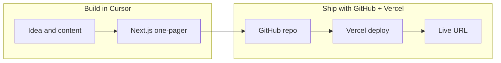

# AI Software Building — One-Page Site Plan

## Goal

Build a **single-scroll teaching website** that walks beginners through building software with:

1. **Cursor** — AI-assisted coding
2. **GitHub** — version control and collaboration
3. **Vercel** — deploy to production

The site itself will be the **live example**: you build it in Cursor, push to GitHub, and deploy on Vercel.



---

## Tech stack

| Layer | Choice | Why |
|-------|--------|-----|
| Framework | **Next.js 15** (App Router) | Vercel-native, easy to extend later |
| Language | **TypeScript** | Safer defaults, good for teaching |
| Styling | **Tailwind CSS** | Fast to style a polished one-pager |
| Hosting | **Vercel** | Zero-config Next.js deploys |
| Repo | **GitHub** | Standard for Vercel integration |

---

## Page structure (one file, anchor sections)

All content lives on [`app/page.tsx`](app/page.tsx) with a sticky nav linking to section IDs.

| Section | ID | What it teaches |
|---------|-----|-----------------|
| **Hero** | `#top` | Headline, one-line promise, primary CTA scroll |
| **Overview** | `#overview` | Why this stack; 3-step mental model (Code → Save → Ship) |
| **Cursor** | `#cursor` | Install, open project, chat/agent, edit with AI, review diffs |
| **GitHub** | `#github` | Create repo, init git, commit, push, `.gitignore` basics |
| **Vercel** | `#vercel` | Import GitHub repo, auto-deploy on push, preview URLs |
| **Walkthrough** | `#walkthrough` | End-to-end: change text in Cursor → commit → see live site update |
| **Footer** | — | Links to Cursor, GitHub, Vercel docs; optional your contact |

Each tool section follows the same pattern for clarity:

- **What it is** (1–2 sentences)
- **What you do** (numbered steps)
- **Pro tip** (one practical tip)

---

## Project scaffold

Initialize in [`c:\Users\sahil\PROJECTS-PTS\website-builder`](c:\Users\sahil\PROJECTS-PTS\website-builder):

```bash
npx create-next-app@latest . --typescript --tailwind --eslint --app --src-dir=false --import-alias="@/*"
```

Expected layout:

```
website-builder/
├── app/
│   ├── layout.tsx      # fonts, metadata, global shell
│   ├── page.tsx        # entire one-pager
│   └── globals.css     # Tailwind + smooth scroll
├── public/             # favicon, optional og-image
├── package.json
├── next.config.ts
├── tailwind.config.ts
└── README.md           # how to run locally + deploy steps
```

---

## UI / design direction

Keep it **simple and readable** — this is a teaching page, not a marketing site.

- **Layout**: max-width container (~768px content), generous vertical spacing between sections
- **Nav**: sticky top bar with links to `#cursor`, `#github`, `#vercel`, `#walkthrough`
- **Typography**: clear hierarchy (one H1, section H2s, short paragraphs)
- **Visual cues**: small icons or badges per tool (Cursor / GitHub / Vercel)
- **Code snippets**: monospace blocks for git commands and example prompts (copy-friendly)
- **Responsive**: single column on mobile; nav collapses to a simple scroll list or hamburger if needed
- **Theme**: light default with subtle accent color (e.g. neutral gray + one accent for CTAs)

No component library required for v1 — plain Tailwind keeps the repo easy to understand for learners.

---

## Content to write (draft copy outline)

We will draft concise, beginner-friendly copy directly in `page.tsx` (or extract to a small `content/sections.ts` if it gets long).

**Example Cursor steps:**
1. Download and install Cursor
2. Open this project folder
3. Use Chat (`Ctrl+L`) or Agent to ask for changes
4. Review the diff before accepting

**Example GitHub steps:**
1. Create a new repo on github.com
2. `git init`, `git add .`, `git commit`, `git remote add`, `git push`
3. Every meaningful change gets a commit with a clear message

**Example Vercel steps:**
1. Sign in at vercel.com with GitHub
2. Import the repo → deploy
3. Push to `main` → site updates automatically

**Walkthrough section** ties it together with a concrete exercise: “Change the hero headline, commit, push, refresh your live URL.”

---

## GitHub setup (after code is ready)

1. Create a **public** repo on GitHub (e.g. `ai-software-building-guide`)
2. Add a [`.gitignore`](.gitignore) (Next.js template includes `node_modules`, `.next`, `.env*`)
3. Initial commit and push to `main`
4. Add a short [`README.md`](README.md): local dev (`npm run dev`), deploy note, live URL placeholder

No secrets in the repo — Vercel handles deploy tokens via GitHub OAuth.

---

## Vercel deployment

1. Go to [vercel.com](https://vercel.com) → **Add New Project**
2. Import the GitHub repo
3. Accept defaults (Next.js auto-detected)
4. Deploy → you get a `*.vercel.app` URL
5. Optional: add custom domain later in Vercel project settings

Every future push to `main` triggers a new production deploy — perfect for demonstrating the workflow in the Walkthrough section.

---

## Local development workflow

```bash
npm install
npm run dev    # http://localhost:3000
npm run build  # verify production build before first deploy
```

Use Cursor Agent to iterate on copy and layout; use GitHub + Vercel for the “ship” loop.

---

## Out of scope for v1 (can add later)

- Blog or multi-page routing
- Auth, CMS, or database
- Analytics (easy add via Vercel Analytics later)
- Video embeds (can link to external tutorials instead)
- Dark mode toggle

---

## Success criteria

- [ ] One scrollable page with all 6 sections and working anchor nav
- [ ] Runs locally with `npm run dev`
- [ ] Code on GitHub; README documents the workflow
- [ ] Live on Vercel; Walkthrough section references the real URL
- [ ] A beginner can follow the page and reproduce: edit → commit → deploy
